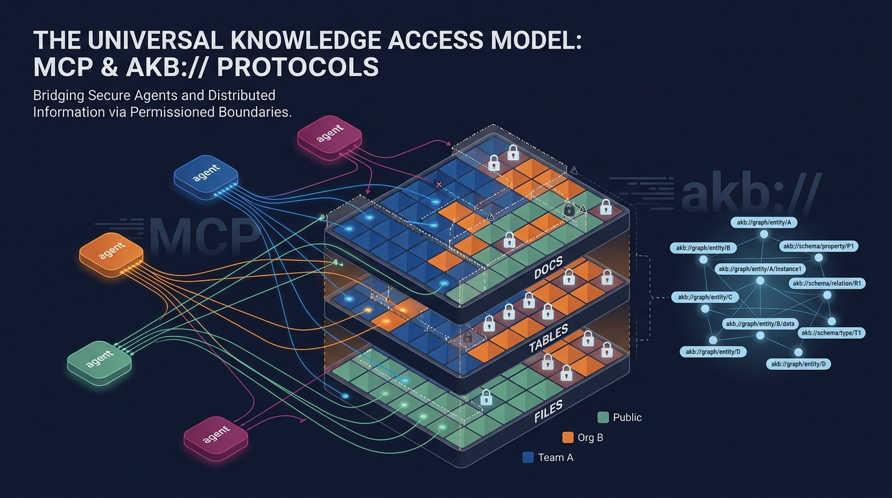

<p align="center">
  
</p>

# AKB — Agent Knowledgebase

> **Organizational memory for AI agents.** Git-backed knowledge base served
> over the **Model Context Protocol (MCP)** — agents read and write directly
> with hybrid semantic + keyword search, structured tables, files, and a URI
> graph. Drop-in alternative to Confluence / Notion for Claude Code, Cursor,
> Windsurf, and any MCP-aware agent.

[](./LICENSE)
[](https://www.npmjs.com/package/akb-mcp)
[](https://modelcontextprotocol.io)

## Works with

Any agent client that speaks **MCP (Streamable HTTP or stdio)**:

- **Claude Code** — CLI / VS Code / JetBrains
- **Claude Desktop** — macOS / Windows
- **Cursor**, **Windsurf**, **Cline**, **Continue** — via the
  [`akb-mcp`](https://www.npmjs.com/package/akb-mcp) stdio proxy
- Custom agents — direct HTTP `POST /mcp/` with a Bearer token

## Why AKB

Most knowledge tools are built for humans clicking through a UI. Agents need a
different shape: structured documents, semantic + keyword search in one call,
explicit relations, and full version history. AKB gives agents a single set of
tools (`akb_put`, `akb_search`, `akb_browse`, `akb_relations`, …) over a
backing store of Git bare repos and a PostgreSQL hybrid index.

## Architecture

```
┌──────────────────────────────────────────────────────────┐
│                  Access Layer                            │
│   MCP Server  │  REST API  │  Web UI                     │
├──────────────────────────────────────────────────────────┤
│                  Core Services                           │
│   Document (Put/Get)  │  Search (Hybrid: dense+BM25)     │
│   Relations (graph)   │  Session  │  Publications        │
├──────────────────────────────────────────────────────────┤
│                  Storage Layer                           │
│   Git bare repos       │  PostgreSQL 16 (text + meta SoT)│
│                        │  Vector store (driver):         │
│                        │    pgvector  (default, same PG) │
│                        │    qdrant    (optional)         │
│                        │    seahorse  (managed, optional)│
└──────────────────────────────────────────────────────────┘
```

PostgreSQL is the source of truth — chunk text + metadata + BM25 vocab.
The vector store is a driver-pluggable derived index holding dense
embeddings and corpus-side sparse vectors. Full vector-store loss is
recoverable from PG by setting `chunks.vector_indexed_at = NULL` and
letting the indexing worker re-populate.

## Key Concepts

- **Vault** — A Git bare repo. The unit of access control and physical isolation.
- **Collection** — A directory inside a vault. Topical grouping of documents.
- **Document** — Markdown + YAML frontmatter, optimised for agent read/write.
- **Hybrid Search** — Dense (semantic) + BM25 (lexical) fused via RRF in one call.
- **Relations** — `depends_on`, `related_to`, `implements` in frontmatter form an explicit knowledge graph.

## MCP Tools (selection)

| Tool | Description |
|------|-------------|
| `akb_list_vaults` / `akb_create_vault` | Vault management |
| `akb_put` / `akb_get` / `akb_update` / `akb_delete` | Document CRUD (Git commit + indexing) |
| `akb_put_file` / `akb_get_file` / `akb_delete_file` | File attachments — proxy-side (requires local filesystem) |
| `akb_create_table` / `akb_alter_table` / `akb_drop_table` / `akb_sql` | Tabular content — per-doc tables + SQL |
| `akb_browse` | Tree traversal (collection → docs) |
| `akb_search` / `akb_grep` | Hybrid search (dense + BM25) / literal grep |
| `akb_drill_down` | Section-level retrieval |
| `akb_relations` / `akb_link` / `akb_unlink` / `akb_graph` | Knowledge graph |
| `akb_edit` / `akb_diff` / `akb_history` | In-place edit, diff, Git history |
| `akb_grant` / `akb_revoke` / `akb_set_public` | Permission boundaries — per-user, per-org, public |
| `akb_remember` / `akb_recall` / `akb_forget` | Agent memory |
| `akb_session_start` / `akb_session_end` | Session lifecycle |
| `akb_publish` / `akb_unpublish` | Public publication |

The full tool catalogue is exposed via `akb_help()` from any MCP client.

## Document Format

Documents are addressed by URI — `akb://{vault}/{path}` is the canonical
handle used by every tool and stored in relations.

```yaml
---
title: "Payment API v2 migration plan"
type: plan              # note | report | decision | spec | plan | session | task | reference
status: active          # draft | active | archived | superseded
tags: [payments, api]
domain: engineering
summary: "REST → gRPC transition plan."
depends_on: ["akb://eng/specs/payment-api-v2"]
related_to: ["akb://eng/meetings/2026-05-01-payments"]
---

# Payment API v2 migration plan
...
```

## Quick Start

AKB ships as a **3-container stack** (PostgreSQL with pgvector + backend +
frontend). You bring an OpenAI-compatible embedding endpoint (OpenAI,
OpenRouter, self-hosted vLLM/TEI, etc.) — that's the only required external
dependency for core CRUD and search. Prefer running a separate Qdrant
cluster, or pointing at a managed Seahorse Cloud table? See *Vector store*
below.

```bash
# 1. Configure
cp config/app.yaml.example   config/app.yaml
cp config/secret.yaml.example config/secret.yaml
$EDITOR config/secret.yaml   # set embed_api_key (and jwt_secret for any non-local deploy)

# 2. Run
docker compose up -d

# 3. Open
open http://localhost:3000
```

`config/app.yaml` and `config/secret.yaml` are the **single source of runtime
configuration** — no environment variables are read by the backend. Mount the
`config/` directory at `/etc/akb/` in any deployment.

### Vector store (driver-pluggable)

Hybrid search (dense + BM25 sparse, RRF-fused) runs through a driver
interface. Three drivers ship; pick at config time:

- **`pgvector`** (default) — uses the same Postgres container that holds
  application data. The pgvector/pgvector image pre-installs the
  extension; the driver creates a separate `vector_index` schema, so the
  main `chunks` table stays plain PostgreSQL. RRF fusion runs
  application-side. No external service to operate.
- **`qdrant`** — runs a separate Qdrant container; native RRF via the
  Query API. Useful when you already operate Qdrant or want to scale
  the vector store independently of Postgres.
- **`seahorse`** — points at a managed [Seahorse Cloud][shc] table over
  its TABLE_V2 + BFF API (Bearer auth, per-table host). No
  infrastructure to run on your side; you provision a table in the
  Seahorse console (or let the driver auto-create one) and AKB stores
  its chunks there. Native RRF, server-side BM25. See
  [`docs/vector-store-seahorse.md`](./docs/vector-store-seahorse.md)
  for the end-to-end setup walkthrough (sign-up → token → schema →
  config).

[shc]: https://console.seahorse.dnotitia.ai

Switching drivers is a config edit (no schema migration on the main DB):

```bash
# Default flow targets pgvector.
docker compose up

# Qdrant:
docker compose -f docker-compose.yaml -f docker-compose.qdrant.yaml up
$EDITOR config/app.yaml     # vector_store_driver: qdrant
                            # vector_url: http://qdrant:6333

# Seahorse Cloud (managed; full guide in docs/vector-store-seahorse.md):
docker compose up           # no extra container needed
$EDITOR config/app.yaml     # vector_store_driver: seahorse
                            # seahorse_tenant_uuid: <your tenant>
                            # seahorse_table_name: <your table>
$EDITOR config/secret.yaml  # seahorse_token: shsk_<...>
```

Embedding model + dimensions are also fully pluggable via
`embed_base_url` / `embed_model` / `embed_dimensions` — the codebase has
no hard-coded model. For pgvector with HNSW, keep `embed_dimensions ≤ 2000`
(or 4000 with `halfvec`); larger models fall back to exact scan.
Qdrant/Seahorse have no such limit (Qdrant up to 65536, Seahorse up to
its table-defined dim).

### LLM features (optional)

LLM is only used by the `metadata_worker` to auto-tag documents imported via
external git mirroring. Core CRUD/search works without it. To enable, set
`llm_base_url` / `llm_model` in `app.yaml` and `llm_api_key` in `secret.yaml`.

### Event fanout (optional)

The PG `events` outbox is always written. Set `redis_url` in `app.yaml` to
have the `events_publisher` worker drain the outbox to a Redis Stream
(`akb:events`) so external services can subscribe via `XREAD` / consumer
groups. Leave blank to disable; events still accumulate in PG and you can
build an SSE endpoint on top of the LISTEN/NOTIFY trigger without Redis.

### Production deployment

For Kubernetes, see [`deploy/k8s/README.md`](./deploy/k8s/README.md). The
`deploy/k8s/` directory contains a generic kustomize base; provide your
own registry, hostname, and TLS issuer via the documented env vars or an
operator-private overlay under `deploy/k8s/internal/`.

## Project Structure

```
akb/
├── backend/                  # Python 3.11 / FastAPI / asyncpg / GitPython
│   ├── app/
│   │   ├── api/routes/       # REST endpoints
│   │   ├── services/         # Business logic + workers
│   │   └── db/               # PostgreSQL schema + migrations
│   ├── mcp_server/           # Streamable HTTP MCP server
│   └── tests/                # E2E shell tests
├── frontend/                 # React 19 + TypeScript + Vite + Tailwind
├── packages/
│   └── akb-mcp-client/       # stdio ↔ HTTP MCP proxy (npm: akb-mcp)
├── agents/                   # Reference Python agent runtime (think/act loop over MCP)
├── templates/                # Doc templates (ADR, PRD, runbook, …) and vault profiles
├── design-system/            # Frontend design system docs
├── config/
│   ├── app.yaml.example      # Non-secret runtime settings
│   └── secret.yaml.example   # API keys, passwords (gitignored when not .example)
├── deploy/
│   └── k8s/                  # Generic kustomize base for Kubernetes
└── docker-compose.yaml       # 3-container local stack (postgres + backend + frontend)
```

## Tech Stack

- **Backend**: Python 3.11, FastAPI, Uvicorn, asyncpg, GitPython, MCP SDK
- **Database**: PostgreSQL 16 (main DB needs no extension; the same
  pgvector/pgvector image hosts the optional vector_index schema)
- **Vector store**: driver-pluggable (pgvector default; Qdrant or
  Seahorse Cloud optional — hybrid dense + BM25 sparse, RRF fusion)
- **Event stream** (optional): PG `events` outbox + Redis Streams fanout
- **Frontend**: React 19, TypeScript, Vite, Tailwind CSS v4, Radix UI
- **Auth**: JWT + Personal Access Tokens (PATs)
- **MCP**: Streamable HTTP (backend) + stdio proxy (`akb-mcp` on npm)

## Versioning

AKB follows [SemVer](https://semver.org/). The product version lives in
`backend/pyproject.toml` (`[project].version`) and is mirrored to
`frontend/package.json` via `scripts/bump-version.sh <x.y.z>`. Each
`deploy/k8s/deploy.sh` run tags the Docker images with both the explicit
version (`:${VERSION}`) and `:latest`, so historical builds remain
pullable for rollback.

`packages/akb-mcp-client` (the `akb-mcp` npm proxy) follows its own npm
semver lifecycle and is **not** tied to the product version.

## License

[PolyForm Noncommercial 1.0](./LICENSE) — free for noncommercial use,
modification, and distribution. Attribution required.

For commercial licensing, contact **opensource@dnotitia.com**.

## Security

Found a vulnerability? See [SECURITY.md](./SECURITY.md) — please report
privately, not via public issues.

## Contributing

See [CONTRIBUTING.md](./CONTRIBUTING.md).
